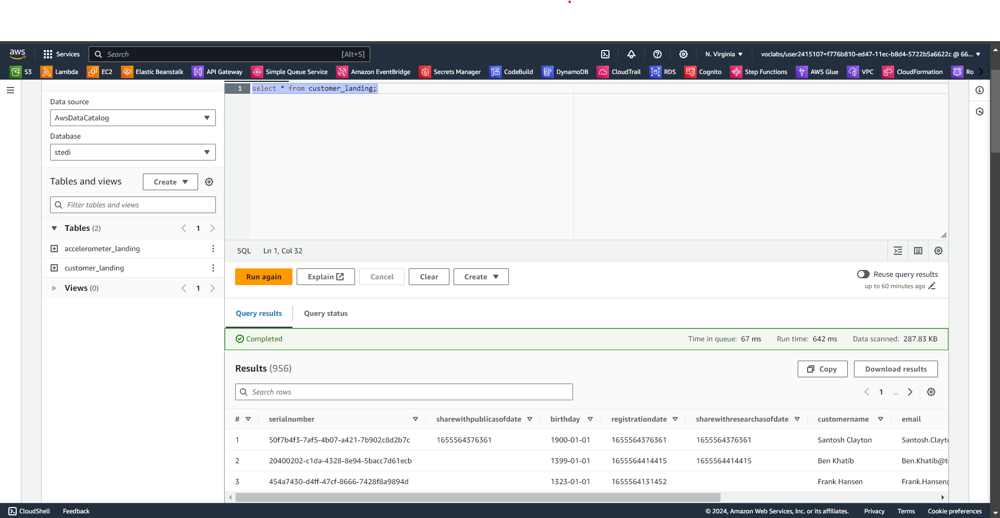
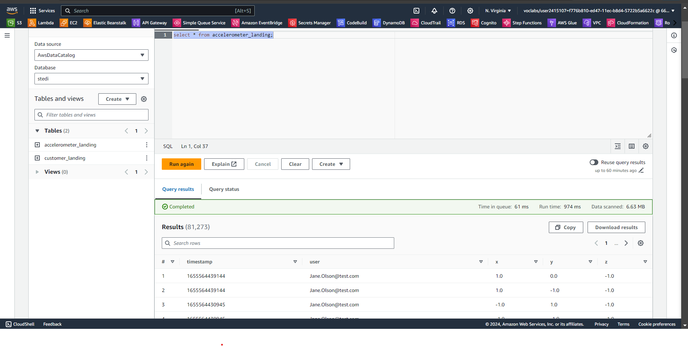
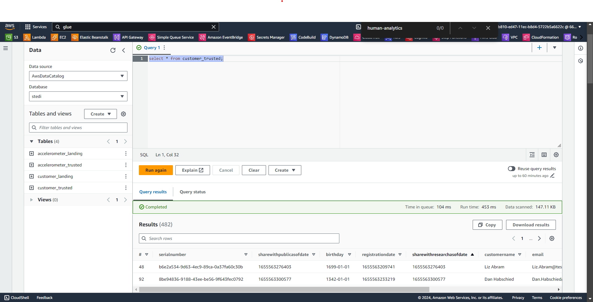
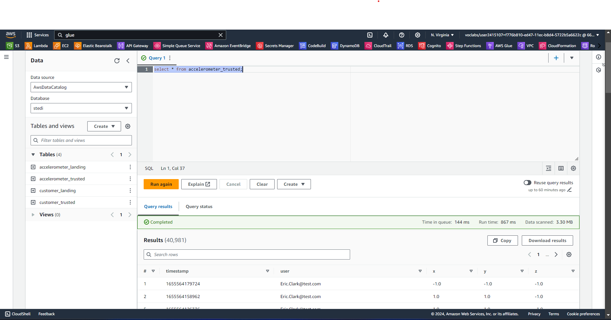

# Human Balance Lakehouse

# Human Balance Lakehouse

This project implements a lakehouse solution in AWS using AWS Glue, AWS S3, Python, and Spark. The solution is designed to meet specific requirements from STEDI data scientists and is part of the AWS Data Engineering nanodegree on Udacity.

Key features:

- Data processing with Python and Spark
- ETL jobs using AWS Glue
- Data storage in AWS S3
- Query capabilities with AWS Athena

The lakehouse architecture enables efficient data management, processing, and analysis for the STEDI balance board application.

## STACK

- Python and Spark
- AWS Glue
- AWS Athena
- AWS S3

## DATA FOLDER (LANDING ZONES)

To simulate the data coming from the various sources, you will need to create your own S3 directories for customer_landing, step_trainer_landing, and accelerometer_landing, and copy the data folder there as a starting point.

### **1. Customer Records**

Contains the following fields:

- serialnumber
- sharewithpublicasofdate
- birthday
- registrationdate
- sharewithresearchasofdate
- customername
- email
- lastupdatedate
- phone
- sharewithfriendsasofdate

### **2. Step Trainer Records (data from the motion sensor):**

Contains the following fields:

- sensorReadingTime
- serialNumber
- distanceFromObject

### **3. Accelerometer Records (from the mobile app):**

Contains the following fields:

- timeStamp
- user
- x
- y
- z

There are **two Glue tables** for the two landing zones: customer_landing.sql and accelerometer_landing.sql.

This is how it looks like customer_landing and accelerometer_landing querying them with **AWS Athena**:





## TRUSTED AND CURATED ZONES

The Data Science team has done some preliminary data analysis and determined that the **Accelerometer Records** each match one of the **Customer Records**. They would like you to create 2 AWS Glue Jobs that do the following:

1. Sanitize the Customer data from the Website (Landing Zone) and only store the Customer Records who agreed to share their data for research purposes (Trusted Zone) - creating a Glue Table called **customer_trusted** (customer_trusted.py). Below the query from Athena of the customer_trusted s3 bucket:

   A screenshot that shows a select \* statement from Athena showing the customer landing data, where the resulting customer trusted data has no rows where shareWithResearchAsOfDate is blank.

   

2. Sanitize the Accelerometer data from the Mobile App (Landing Zone) - and only store Accelerometer Readings from customers who agreed to share their data for research purposes (Trusted Zone) - creating a Glue Table called **accelerometer_trusted**. Below the query from Athena of the accelerometer_trusted s3 bucket:

**NOTE**:

For AWS Glue to act on your behalf to access S3 and other resources, you need to grant access to the Glue Service by creating an IAM Service Role that can be assumed by Glue:

```
aws iam create-role --role-name my-glue-service-role --assume-role-policy-document '{
    "Version": "2012-10-17",
    "Statement": [
        {
            "Effect": "Allow",
            "Principal": {
                "Service": "glue.amazonaws.com"
            },
            "Action": "sts:AssumeRole"
        }
    ]
}'
```

Data Scientists have discovered a data quality issue with the Customer Data. The serial number, which should uniquely identify each STEDI Step Trainer purchased, has been affected by a defect in the fulfillment website. This defect caused the same 30 serial numbers to be reused for millions of customers. While most customers haven't received their Step Trainers yet, those who have are submitting Step Trainer data over the IoT network to the Landing Zone. Importantly, the data from these Step Trainer Records contains the correct serial numbers.

The main challenge arising from this serial number bug in the fulfillment data (Landing Zone) is that we cannot accurately associate the Step Trainer Records data with specific customers. This mismatch between the customer data and the Step Trainer data creates a significant obstacle in data analysis and customer service.

The Data Science team would like you to write a Glue job that does the following:

3. Sanitize the Customer data (Trusted Zone) and create a Glue Table (Curated Zone) that only includes customers who have accelerometer data _and_ have agreed to share their data for research called **customer_curated** (customer_curated.py).

Finally, you need to create two Glue Studio jobs that do the following tasks:

4. Read the Step Trainer IoT data stream (S3) and populate a Trusted Zone Glue Table called **step_trainer_trusted** that contains the Step Trainer Records data for customers who have accelerometer data and have agreed to share their data for research (customer_curated). Look for it step_trainer_trusted.py

5. Create an aggregated table that has each of the Step Trainer Readings, and the associated accelerometer reading data for the same timestamp, but only for customers who have agreed to share their data, and make a glue table called **machine_learning_curated.** You can find it in machine_learning_curated.py
